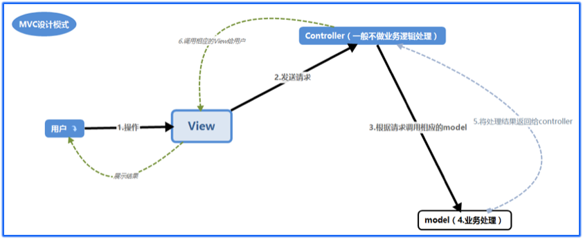

# MVC Learn
### MVC概念
V：  
- 视图，即页面，如html、jsp等格式

M：
- 模型，代表数据和业务逻辑，其实也就是后台接口，用于对业务逻辑进行处理，其中包含操作数据库
- 模型对于数据来说是中立，任何一个模型都不是针对某一数据而写的，而是通用的，一个模型可以为任何一个或多个试图提供数据，M通常是代码量最多也是最复杂的部分

C：
- 控制器，接收用户的请求数据，调用M来处理用户的请求数据，再把处理结果传递给V展示给客户，C由于仅负责调用，所以通常是代码最少的部分

### MVC的调用顺序：
用户通过V把请求数据传递给C，C再调用M来处理用户的请求数据，M处理完成后把结果传递给V，V再把结果展示给用户。

#### 可插拔的视图
1. 在MVC中，通常会把一个模块（多个页面的多个子功能）放到一个包中，如所有与登录和注册相关功能放到一个包中。在每个包中，都有一个自己本包的视图文件
2. 在本包的视图文件中，会把本包内所有的视图函数放到一个文件内，但这个文件仅限于放视图函数，启动项目不在此文件中
3. 要有一个主文件，用于启动项目
